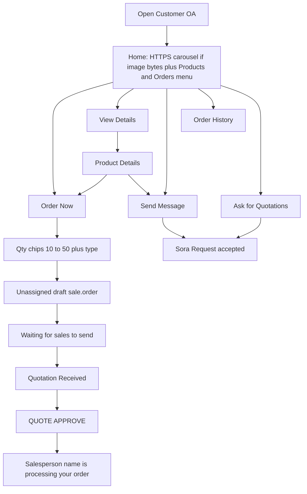
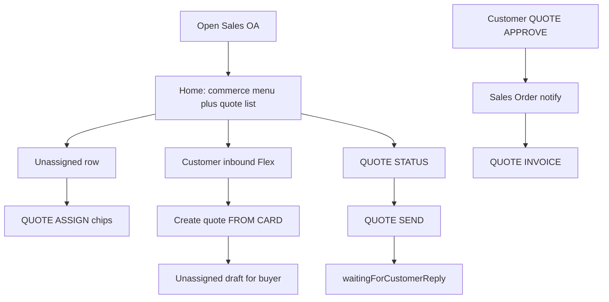

# Agent prompt — Cloudnex Connect LINE OA (Sales + Customer)

You are implementing Cloudnex Connect (`cloudnex-connect`): TypeScript Express + LINE Official Accounts + Odoo. Follow `CLAUDE.md`, `AGENTS.md`, `.cursor/rules/cns-platform.mdc`. Read the smallest files; grep before full reads; **no new npm packages**; do **not** production-deploy (`deploy:vps-prod`, Cloud Run `deploy:prod`, `release.yml` dispatch). Staging only after tests pass.

**Command, label, env, and i18n Action→Result tables** live in [`LINE_OA_AGENT.md`](LINE_OA_AGENT.md). Do not copy those tables here. If this file and that file disagree with TypeScript, **the code wins** — update both docs in the same change.

---

## Non-negotiables

- One `resolveCommandReply`. HMAC `POST /webhook`, `/webhook/:channelId` (`sales`, `customer`), gated `/webhook-alt`. GraphQL ingest when flagged still joins the same processor.
- Identity: LINE id → profile SoR (Firestore, or Mongo if `MONGO_USERS`) → `odooVerified` → `ADMIN_USER_ID` → Odoo admin capability → `role=admin`. Super-admin web: `SUPER_ADMIN_USER_IDS` + bound actor.
- Odoo masters via `getErpAdapter()`. Mongo is never Odoo SoR. Non-odoo `ERP_PROVIDER` stays unimplemented.
- Gate, OTP, audit, and Flex `action.text` use **canonical English prefixes**. Users see Admin `labelEn`/`labelTh` (≤20 on LINE actions) and `src/services/i18n.ts`. Do not rename handler `match:` strings.
- Overlay **aliases** (P4) normalize **inbound** typed text to canonical; buttons still **emit** canonical. Reject alias collisions with another prefix or another command.
- Locales: EN and TH only. Visible agent name `Sora` / `Sora ` → `Sora: `; `โซระ` → `โซระ: ` (`withAgentColon`). Never inside product names.
- HMAC `:8080`. Admin staging `{PUBLIC_BASE_URL}/admin/test` on the sibling host; production Admin `/admin/`. Do not mix HMAC ports.
- Commit only when asked; never `.env`; style `Release: vX.Y.Z - Odoo Line OA vN …`.

---

## Storyboard (shipped)

This is the tap-level journey the Official Accounts must perform. Every Flex button still posts a **canonical** command.

### Customer OA (`POST /webhook/customer`)

| Beat | What the user sees | Wire command | System result |
|---|---|---|---|
| Home | Product carousel (hero only if `readProductImage128` ≥32 bytes) + commerce actions. Price left, amount `xl` right. No stock. | `NAV HOME` | ≤5 LINE messages. Catalog miss may push later; skip push while qty/form keyboard is up. |
| Order Now | Qty chips (`CUSTOMER_QTY_CHIPS`, default 10–50; chips+Cancel+Skip ≤13) | `FORM QUOTE CREATE FROM CARD {id}` → `QUOTE CREATE` | Unassigned draft (`user_id` empty). OTP on create. Waiting card. |
| View Details | Description if Odoo has it. Footer Order Now, Send Message, Home, Back | `PRODUCT FIND {name}` | Details bubble, not qty. |
| Send Message | Guided body | `FORM MESSAGE REQUEST {id}` → `MESSAGE REQUEST CONFIRM` | Partner note with `productId=`; sales ping; `{agent}: Request accepted. We will get back to you soon.` |
| Ask for Quotations | Same accepted copy | `QUOTE ASK` | Chatter note; **no** new SO. |
| Order History | List of partner SOs | `QUOTE LIST` | Page size **5**; More = `QUOTE LIST CURSOR` labeled Next 5. |
| Sales sent quote | State **Quotation Received**; Confirm | `QUOTE APPROVE {id}` | SO; sales notified; if `user_id[1]` present, `{name} is processing your order.` |
| Keyboard | Chat-bar / blank rich menu | (no extra command) | Await unlink then link `keyboard` id. Unlink alone restores OA **default** tray. |

Customer OA must not run: `ADMIN *`, `QUOTE ASSIGN`, `RELAY *`, `STAFF PICK`, `SALES FEATURES`, `MESSAGE CUSTOMER`, directory/catalog writes, `DAILY REPORT`, `SEGMENT CUSTOMERS`, `SEED SAMPLE DATA`. Staff convert is `QUOTE CONFIRM`; customer confirm is `QUOTE APPROVE`.

### Sales OA (`POST /webhook/sales` or default)

| Beat | What the user sees | Wire command | System result |
|---|---|---|---|
| Home | **Two** messages: commerce action menu **and** quote list (not list-only). | `NAV HOME` | Admin list = CRM (unassigned first). Sales User = `user_id` self. Page **5**. |
| Unassigned | Assign salesperson | `QUOTE ASSIGN {id}` then `QUOTE ASSIGN {id} {odooUserId}` | LINE `role=admin` + admin chain. Sets `sale.order.user_id`. |
| Inbound / RFQ | Create quote + relay chips | `FORM QUOTE CREATE FROM CARD {productId} [{qty}] [{customerLineId}]` | Seed buyer name/phone; reconstruct `QUOTE CREATE id:n,qty,name,phone,RFQ,…`; **unassigned** draft. OTP on create. |
| Send | LINE / email / both | `QUOTE SEND` → `QUOTE SEND CONFIRM` | Odoo `sent`; customer Confirm; sales waits. |
| Staff confirm | Confirm | `QUOTE CONFIRM {id}` | Draft/sent → SO. OTP. |
| Labels | Quotations / View Quote / Quotation Sent | overlay + i18n | Sales glossary, not customer Order History. |

`NAV COMMERCE` on Sales is the action menu (no customer carousel). Dual Home does **not** add a second webhook or router.

---

## Language vs command (do not miss)

| Layer | Storage | Who edits | Used for |
|---|---|---|---|
| Canonical prefix | `COMMAND_GRID`, handler `match:`, `COMMAND_PREFIX_SERVICE_MAP`, rich-menu `action.text`, `buildFinalCommand` | Developers | Routing, OTP, service gate, audit |
| Button/menu EN/TH | Overlay + grid defaults | Admin Commands | Flex, menus, glossary (≤20) |
| Aliases | Overlay `aliases[]` | Admin Commands | Inbound shortcuts only |
| Body/status | `src/services/i18n.ts` | Code | Flex bodies, chips |
| Admin chrome | `admin/src/i18n.ts` | Code | Admin nav, not LINE |
| Chat language | Profile `language` | `LANG` / `ENGLISH` / `THAI` | `t()` / `pickLocale` |

**Admin Commands:** Prefix column is **read-only**. EN/TH change what people read. Aliases do not appear on buttons.

Full inventory (every command Action→Result, env, i18n keys): [`LINE_OA_AGENT.md`](LINE_OA_AGENT.md) sections 4–6. Env keys not listed there: [`src/http/env-params.ts`](../src/http/env-params.ts).

---

## Surfaces

| Surface | Role |
|---|---|
| This file | Agent execution prompt + storyboard |
| `documents/LINE_OA_AGENT.md` | Operator contract tables |
| `CLAUDE.md` / `AGENTS.md` / `CURSOR.md` / `cns-platform.mdc` | Architecture; they link the contract |
| `.claude/skills/line-oa-operator/SKILL.md` | When to load the contract |
| Cursor MCP `healthz` / `readyz` / `/ops/platform` | Live ops — **does not define LINE commands** |
| LINE Console | Tray PNG + keyboard rich-menu id |

---

## Phases (status)

1. **P0 shipped** — images-if-bytes, keyboard unlink+link, qty chips, details CTAs, glossary, `Sora:`.
2. **P1 shipped** — Sales dual Home, RFQ Create quote, list page 5, salesperson name after approve. One router.
3. **P2 shipped** — Admin Commands = human language; prefix read-only; aliases column (P4).
4. **P3** — CI is `lint` / `build` / `npm test` / `npm audit --omit=dev --audit-level=high`. Staging only if `ENABLE_STAGING_VPS_DEPLOY` is exactly `true`. Do not delete failed GitHub runs as the fix. Health: `https://amardhaka.io/healthz`, Admin `/cloudnex-connect/admin/test`.
5. **P4 shipped** — Overlay aliases; canonicalize inbound; reject collisions; emit canonical.

Latency: no extra Odoo on the HMAC reply path beyond existing list/home; catalog cache; notify sales async.

**Done when:** Customer OA readable EN/TH, gates on canonical commands, no white 404 heroes, qty keyboard if Console id set, Sales dual Home + RFQ + page 5 + salesperson name, Admin prefix read-only, aliases tested, `tsc` + targeted Vitest pass. Prefixes in handlers unchanged.
