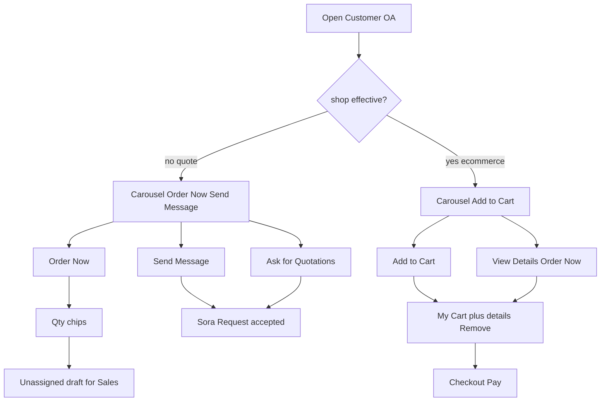
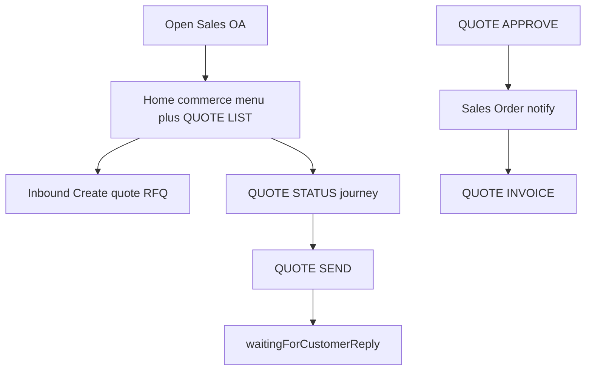

# LINE OA operator and agent contract

**Source of truth** for Cloudnex Sales and Cloudnex Customer Official Accounts: canonical commands vs readable language, Action → Result, env, journeys, and delivery phases.

If this file disagrees with running TypeScript, **the code wins**. Update this file in the same change. Do not copy these tables into `CLAUDE.md`, always-on Cursor rules, or skills.

| Surface | Role |
|---|---|
| This file | Operator/agent contract (commands, labels, journeys, env Action→Result) |
| `CLAUDE.md` / `AGENTS.md` / `.cursor/rules/cns-platform.mdc` | Architecture and token budget; they **link here** |
| `.claude/skills/line-feature/SKILL.md` | How to change LINE code without a second router |
| `.claude/skills/line-oa-operator/SKILL.md` | When to load this file |
| `.cursor/mcp.json` + `src/mcp/server.ts` | Live `healthz` / `readyz` / `/ops/platform` / webhook-test. **Does not define LINE commands.** LINE Developers MCP is console-only. |
| Admin Commands | `labelEn` / `labelTh` (≤20 chars), enabled, roles, channels — **not** handler prefixes |
| LINE Console rich menus | Tray PNG + `action.text` (canonical). Keyboard variant id in env JSON |

---

## 1. Non-negotiables

- One `resolveCommandReply`. HMAC `POST /webhook`, `/webhook/:channelId` (`sales`, `customer`), gated `/webhook-alt`. GraphQL ingest when flagged still joins the same processor.
- Identity: LINE id → profile SoR (Firestore, or Mongo if `MONGO_USERS`) → `odooVerified` → `ADMIN_USER_ID` → Odoo admin capability → `role=admin`. Super-admin web: `SUPER_ADMIN_USER_IDS` + bound actor.
- Odoo masters via `getErpAdapter()`. Mongo is never Odoo SoR. Non-odoo `ERP_PROVIDER` stays unimplemented.
- Locales: **EN and TH only**. Agent speech: visible `Sora` or `Sora ` → `Sora: `; `โซระ` → `โซระ: `. Apply in bot titles/bodies that use `getAgentName`, never inside product names.
- No new npm packages. No production deploy from this spec (`deploy:vps-prod`, Cloud Run `deploy:prod`, `release.yml` dispatch). Staging only after tests pass.
- HMAC `:8080`. Admin staging `{PUBLIC_BASE_URL}/admin/test` on the sibling host; production Admin `/admin/`. Do not mix HMAC ports.

---

## 2. Language vs command

| Layer | Storage | Who edits | Used for |
|---|---|---|---|
| Canonical prefix | `COMMAND_GRID`, handlers `match:`, `COMMAND_PREFIX_SERVICE_MAP`, rich-menu `action.text`, guided `buildFinalCommand` | Developers | Routing, OTP, service gate, audit |
| Button/menu EN/TH | Overlay + grid defaults | Admin Commands | Flex buttons, menus, glossary (≤20 chars) |
| Body/status/errors | `src/services/i18n.ts` | Code (or uiOnly overlay rows) | Flex bodies, chips, LINE toasts |
| Admin chrome | `admin/src/i18n.ts` | Code | Admin nav, not LINE |
| Chat language | Profile `language` | `LANG` / `ENGLISH` / `THAI` / `ภาษาไทย` | `t()` / `pickLocale` |
| Persona | `LINE_AGENT_NAME_EN` / `_TH` | Env / runtime settings | `getAgentName` / `withAgentColon` |
| Tray PNG | `assets/rich-menu` + upload | Operator | Native 2×3 |

**Gate** on English prefixes (`NAV COMMERCE`, `QUOTE LIST`). **Users see** readable labels. Flex `action.text` stays **canonical**. Do not rename handler `match:` strings.

**P4 (optional):** overlay `aliases[]` normalize **inbound** to canonical; still **emit** canonical on buttons. Reject collisions.

Sales copy: Quotation / Quotation Sent / View Quote / My quotations. Customer: Order History, Order Details, Request for Order, Quote Received, Order. Pass `channelId` or `audience: 'customer' | 'staff'` into `stateLabel` and journey Flex.

How to read tables below: **Command** = wire/gate. **User sees** = EN / TH. **Action** = user or operator. **Result** = system + next UI. Do not ship a new command or env without an Action→Result row.

---

## 3. Journeys

**Customer Home:** carousel (HTTPS hero: Odoo photo `{PUBLIC_BASE_URL}/catalog/product/{id}/image?v=png` when a photo exists, else `{PUBLIC_BASE_URL}/catalog/product/placeholder/image` camera / no-photo PNG) + commerce actions. Header caption is the shop slug (`website_url`, Internal Reference, or name → `app-premium`), not the word Catalog. Price uses the same teal highlight box as Order **Total** (label `xs` over amount `xl`); hide stock.

| Step | Canonical | Result |
|---|---|---|
| Order Now | `FORM QUOTE CREATE FROM CARD {id}` then `QUOTE CREATE` | Product Details. Qty chips; quote mode: unassigned draft. Shop: add to website cart, then reply **My Cart + Product Details** with **Remove** on the added SKU. Cart CTA stays Checkout. Lines: `10 × DualForth` + price; delivery shows rate, not ×1. HTML T&C stripped. |
| Add to Cart | `FORM CART ADD FROM CARD {id}` | Shop carousel. Same My Cart + details reply. **Remove** only on SKUs already in the cart (carousel pair Add to Cart \| Remove; details Replace Order Now). |
| Remove (empty cart) | `CART REMOVE {id}` | Unlinks the line. If no product lines remain → Product Catalog (NAV HOME). |
| View Details | `PRODUCT FIND id:{id}` | **Product Details only** — same catalog hero URL as Home. Do not append catalog Home. Price = Order Total highlight box. Short description = paper `xs` note (same as “Sales will send this quote…”). **Order Now**, Send Message, then Home, Back. **Back** = catalog Home. |
| Send Message | `FORM MESSAGE REQUEST` → `MESSAGE REQUEST CONFIRM` | Partner note; sales ping; `{agent}: Request accepted. We will get back to you soon.` |
| Ask for Quotations | `QUOTE ASK` | Same accepted copy; no new SO |
| Order History | `QUOTE LIST` | Partner orders |
| After sales send | Journey `sent` | Customer **Quote Received**; Confirm = `QUOTE APPROVE {id}` |
| After SO | Portal / invoice Flex | Existing invoice path |

**Keyboard:** `pendingFlow` or qty `quickReply` → do not `applyTrayAfterReply`; await unlink then await link `keyboard`. Ids: `LINE_CHANNEL_CUSTOMER_RICH_MENU_JSON` `en.keyboard` / `th.keyboard` or `LINE_CHANNEL_CUSTOMER_KEYBOARD_RICH_MENU`. LINE Console must publish a blank/chat-bar menu; unlink alone restores the **OA default tray**. Skip `pendingCatalogPush` until the flow ends.

Customer OA Home replies with cached catalog (or defers Odoo) so LINE HMAC is not blocked. Shop CTAs use env (`CUSTOMER_COMMERCE` + `ODOO_WEBSITE_ID`); add-to-cart still fail-closes without `website_sale`.

**Sales Home:** commerce action menu immediately; `syncStaffProfile` + quote list are a follow-up push (≤2 messages) so NAV HOME is not blocked on Odoo. Product Details / product carousel / `SERVICE READ` use the same HTTPS catalog hero as Customer OA. Admin: CRM with unassigned first; Sales User: `user_id` = self. List page **5**. Unassigned → `QUOTE ASSIGN {id}` then chips `QUOTE ASSIGN {id} {odooUserId}` (LINE `role=admin`). RFQ inbound Flex **Create quote** → `FORM QUOTE CREATE FROM CARD {productId} [{qty}] [{customerLineId}]` / `QUOTE CREATE` with buyer identity; draft **unassigned**. After approve: `tFill('quoteApprovedProcessing')` with `order.user_id[1]` when present.

Customer OA must not run: `ADMIN *`, `QUOTE ASSIGN`, `RELAY *`, `STAFF PICK`, `SALES FEATURES`, `MESSAGE CUSTOMER`, directory/catalog writes, `DAILY REPORT`, `SEGMENT CUSTOMERS`, `SEED SAMPLE DATA`. Staff convert is `QUOTE CONFIRM`; customer confirm is `QUOTE APPROVE`.

Customer OA commerce is exclusive **quote XOR shop** (`CUSTOMER_COMMERCE`). Unset = **quote** (previous Customer setup: Order Now + Send message → Sales OA). `shop` needs `website_sale` **and** `ODOO_WEBSITE_ID` or stay quote + `degraded`. Shop Home uses **My Cart** (`CART`; `CART VIEW` is an alias, not a menu row). Flex: cart (add products) → order process → optional coupon → web Pay (`/shop/pay` → Odoo) → callback → Order completed. Optional Website cart `/shop/cart`. **Sales OA commands stay quote/CRM** (`QUOTE LIST`, `QUOTE CREATE`, `QUOTE SEND`, `QUOTE ASSIGN`) — shop prefixes are Customer-channel only.

---

## 4. Commands (Action → Result)

OTP on reconstructed writes (`requiresOtp` in `service-catalog.ts`): `QUOTE CREATE`, `QUOTE CONFIRM`, `QUOTE SEND CONFIRM`, `QUOTE ADD/EDIT/REMOVE/CANCEL`, `QUOTE INVOICE`, `QUOTE INVOICE SEND CONFIRM`, `QUOTE MESSAGE`, `MESSAGE CUSTOMER`, `CART ADD/COUPON/REMOVE/CLEAR`, directory/catalog mutates. `FORM *` only starts a flow.

### Navigation and identity

| Command | User sees EN / TH | Action | Result |
|---|---|---|---|
| `NAV HOME` | Home / หน้าแรก | Tap Home | Customer: carousel + commerce. Sales: commerce menu immediately; quote list follows |
| `NAV` | Navigate / เมนู | Type NAV | Same as Home |
| `BACK` | Back / กลับ | Tap Back | Same as Home |
| `NAV COMMERCE` | Products & Quotes / สินค้าและใบเสนอราคา (Customer menu: Products & Orders) | Tap Products | Customer: Find a product, then Order History / My Cart / Ask for Quotations, plus catalog carousel. Payload `NAV COMMERCE` |
| `NAV CATALOG` | Catalog / บริการ | Tap Catalog | Service catalog if enabled |
| `NAV VERIFY` | Verify / ยืนยันตัวตน | Tap Verify | `FORM VERIFY` |
| `FORM VERIFY` | Verify form / ฟอร์มยืนยัน | Open wizard | Completes into `VERIFY START` / OTP |
| `VERIFY` | Verify / ยืนยันตัวตน | Type VERIFY | Verify entry |
| `VERIFY START` | (form) | Submit phone/name | OTP / magic link; lockout after max attempts |
| `VERIFY OTP` | (form) | Enter OTP | `odooVerified`; sales session if `res.users` |
| `VERIFY STATUS` | — | Type status | Verification state |
| `VERIFY SIGNOUT` | — | Sign out | Clears sales gold session |
| `FORM CUSTOMER REGISTER` | New customer / สมัครลูกค้าใหม่ | Customer OA | Name/phone → `CUSTOMER REGISTER` |
| `CUSTOMER REGISTER` | New customer | Form done | Odoo partner; not admin |
| `LANG` | Language / ภาษา | Tap Language | Toggle / picker |
| `LANG EN` / `ENGLISH` | English | Choose EN | Profile `language=en` |
| `LANG TH` / `THAI` / `ภาษาไทย` | Thai / ไทย | Choose TH | Profile `language=th` |
| `GUIDE` | Guide / คู่มือ | Tap Help | How-to Flex |
| `HELP` / `START` / `OPTIONS` / `MENU` / `เริ่มต้น` | Help / Start | Type | Home or help |
| `SKIP` | Skip / ข้าม | Skip optional field | Next step |
| `CANCEL` | Cancel / ยกเลิก | Cancel form | Clears `pendingFlow`; restores default tray |
| `FORM FIELD n` | (chip) | Optional summary | Jump to field n |
| `FEATURES` / `JOURNEY` / `DEMO JOURNEY` / `RUN DEMO JOURNEY` | — | Demo/help | Demo text/journey |
| `NAME` / `BOT NAME` / `WHAT IS YOUR NAME` / `ชื่ออะไร` | — | Ask name | Persona name |
| `HUMAN` / `AGENT` / Thai human phrases | Contact admin | Escalate | Handoff |
| `HUMAN OFF` / `RESUME BOT` | Resume bot | Resume | Bot on |

### Catalog and ordering

| Command | User sees | Action | Result |
|---|---|---|---|
| `FORM PRODUCT FIND` | Find a product / ค้นหาสินค้า | Start search | Customer Products & Orders: above Order History. Prompt → `PRODUCT FIND` |
| `PRODUCT FIND` name or `id:N` | Find a product | Search or View Details | Id hit: **Product Details**. Id miss: name search. 0: error. Many: catalog carousel. One: Product Details. Journey continues (Order Now / qty). |
| `FORM QUOTE CREATE FROM CARD {id}` | Order Now | Product Details Order Now | Qty then `QUOTE CREATE`. Shop: My Cart + details with Remove |
| `FORM CART ADD FROM CARD {id}` | Add to Cart | Shop carousel | Qty then `QUOTE CREATE …,cart`. Shop: My Cart + details with Remove |
| `CART` | My Cart / ตะกร้าของฉัน | Open cart | Shop only. Flex lines with per-SKU Remove, full-width Checkout. `CART VIEW` still works as an alias. |
| `CART CHECKOUT` | Checkout / ชำระเงิน | Order process Flex | Optional coupon, then Pay |
| `CART COUPON {code}` / `FORM CART COUPON` | Coupon / คูปอง | Apply code | Optional. Odoo coupon/loyalty; fail-closed if RPC misses |
| `CART PAY` | Pay / ชำระเงิน | Web pay | Signed `GET /shop/pay` → Odoo HTTPS portal. Callback `GET /shop/pay/return` and `POST /ops/odoo-hook` `payment.done` |
| `CART STATUS` | Check payment / ตรวจสอบการชำระ | Poll Odoo | Paid → Order completed Flex; else Pay card |
| `CART ADD {id} {qty}` | Add to cart | Merge line | Same draft `website_id` SO |
| `CART REMOVE` / `CART CLEAR` | Remove / Clear | Edit cart | Line unlink or cancel draft. Empty cart → catalog Home |
| `FORM QUOTE CREATE` | Create a quote / สร้างใบเสนอราคา (Customer title: Request for Order) | Start form | Staff extras; customer product+qty |
| `QUOTE CREATE …` | (after form) | Submit | Draft SO. Customer: `user_id` empty. Staff: their Odoo user if mapped. OTP |
| `FORM QUOTE ADD` / `QUOTE ADD` | Add more products / เพิ่มสินค้า | Add line | OTP |
| `FORM ORDER STATUS` / `ORDER STATUS` | Order status / สถานะออเดอร์ | Look up | → `QUOTE STATUS` |
| `QUOTE STATUS {id}` | (row) | Open quote | Journey Flex |
| `QUOTE LIST` | Customer: Order History / ประวัติคำสั่งซื้อ. Sales: Quotations / ใบเสนอราคา | List | Customer partner; Sales User own; LINE admin CRM. More → `QUOTE LIST CURSOR` |
| `QUOTE ASK` | Ask for Quotations / ขอใบเสนอราคา | Customer tap | Chatter + accepted copy |
| `FORM MESSAGE REQUEST {id}` | Send message / ส่งข้อความ | Send Message | Guided body |
| `MESSAGE REQUEST CONFIRM` | — | Form done | Note; Sales ping; accepted copy |
| `SERVICE LIST` | Browse catalog / รายการบริการ | List | Services |
| `SERVICE READ` | View a service / ดูบริการ | Open | Service card |
| `FORM SERVICE READ` | Find a service | Form | → `SERVICE READ` |
| Qty utterance `N Product` | (typed) | Customer OA | → `QUOTE CREATE` |

Also: `QUOTE LIST OFFSET`, `QUOTE LIST FROM … TO …`.

### Customer journey (payload canonical; portal is URI)

| Command / URI | User sees | Action | Result |
|---|---|---|---|
| `QUOTE APPROVE {id}` | Confirm / ยืนยันคำสั่งซื้อ | Confirm **sent** quote | SO; sales notified; thank-you / processing (P1 name) |
| Portal | Order Details / รายละเอียดออเดอร์ | Open portal | Browser |
| PDF | Download / ดาวน์โหลด | Open PDF | Browser |

### Sales quote, invoice, assign

| Command | User sees | Action | Result |
|---|---|---|---|
| `QUOTE CONFIRM {id}` | Confirm / ยืนยันคำสั่งซื้อ | Staff convert | → Sales Order. OTP |
| `QUOTE SEND {id}` | Send / ส่ง | Open composer | LINE / email / both |
| `QUOTE SEND OPTIONS {id}` | Send Email etc. | More paths | Same composer |
| `QUOTE SEND CONFIRM {id} LINE\|EMAIL\|BOTH [email]` | Send LINE / Email / both | Confirm | Odoo **sent**; Customer push and/or email; Sales waiting. OTP |
| `QUOTE MORE {id}` | More / เพิ่มเติม | Extra tools | Lines, cancel, message |
| `QUOTE LINES {id}` | — | Lines UI | Line list |
| `QUOTE EDIT` / `QUOTE REMOVE` | Edit / Remove | Change line | OTP |
| `QUOTE CANCEL {id}` | Cancel | Cancel | OTP |
| `QUOTE INVOICE {id}` | Invoice / ใบแจ้งหนี้ | Create invoice | When status allows. OTP |
| `QUOTE INVOICE SEND {id}` | Send Invoice / ส่งใบแจ้งหนี้ | Composer | Invoice send |
| `QUOTE INVOICE SEND CONFIRM` | — | Confirm | Customer view/download. OTP |
| `FORM QUOTE SEND` / `FORM INVOICE SEND` | — | Guided send | Reconstructs send confirm |
| `QUOTE ASSIGN {id}` | Assign salesperson / มอบหมายพนักงานขาย | Unassigned | Chips of verified sales |
| `QUOTE ASSIGN {id} {odooUserId}` | (name chip) | Pick | Sets `user_id`. LINE admin only |
| `QUOTE MESSAGE {id}` | — | Note | OTP |
| `QUOTE CREATE MORE` | Create More | Another quote | Restart create |
| `FORM MESSAGE CUSTOMER` / `MESSAGE CUSTOMER` | Message a customer | Admin to buyer | Customer OA push. OTP |
| `RELAY ASSIGN` / `RELAY TO` / `STAFF PICK` | Assign inbound / Relay / More salespeople | Route chat | Relay / wait |

### Directory, admin, ops

| Command | User sees | Action | Result |
|---|---|---|---|
| `FORM USER CREATE` / `USER CREATE` | Add a customer | Admin | `res.partner`. OTP |
| `FORM USER READ` / `USER READ` | Look up a customer | Search | Partner card |
| `FORM USER UPDATE` / `USER UPDATE` | Edit | Update | OTP |
| `FORM USER DELETE` / `USER DELETE` | Delete | Delete | OTP |
| `FORM SERVICE CREATE` / `SERVICE CREATE` | Add an item | Create | OTP |
| `SERVICE UPDATE` / `DELETE` + FORM | Edit / Delete item | Mutate | OTP |
| `DAILY REPORT` | Daily report / รายงานประจำวัน | Admin | Snapshot Flex |
| `SEGMENT CUSTOMERS` | — | Run segments | Real multicast — dangerous |
| `SEED SAMPLE DATA` | — | Seed | Staging/dev Odoo rows |
| `SYSTEM STATUS` | — | Type | Platform text |
| `ADMIN VERIFY` | Admin verify | Check chain | Capability |
| `ADMIN ENABLE` | Enable admin | Request admin | Fail-closed; **Sales OA only** |
| `ADMIN DISABLE` / `ADMIN REVOKE` | Disable / Revoke | Drop admin | Role cleared |
| `ADMIN ACCESS` | Admin access | Show | Summary |
| `ADMIN CHANNEL …` | Channel services | Set services | Overlay |
| `ADMIN CONFIG` | Admin config | Dump | Non-secrets |
| `ADMIN AUDIT ROTATE` | Rotate audit | Rotate | Retention |
| `SALES FEATURES` / `SALES FEATURE …` | — | Toggle groups | Without `ADMIN ENABLE` |
| `ACTION VERIFY` | — | Step-up OTP | Unlocks write |
| `MY DATA` / `ข้อมูลของฉัน` | My data | View | Privacy card |
| `DELETE MY DATA` / `CONFIRM DELETE MY DATA` | Delete my data | Wipe LINE profile | Not Odoo master |
| `PROMO ON` / `รับโปรโมชัน` / `PROMO OFF` / `ไม่รับโปรโมชัน` | Promo | Opt in/out | Multicast honors OFF |
| `SKILLS` / `LIST SKILLS` / skill lines | — | Dynamic | Odoo field skills |

### uiOnly (Admin renames labels; routing unchanged)

| Overlay id | Default EN / TH | Action | Result |
|---|---|---|---|
| `ui-catalog-stock` | Stock / คงเหลือ | Hide on customer | No stock on carousel |
| `ui-catalog-image` | Product image | Disable | No Flex hero |
| `ui-catalog-view` | View Details / ดูรายละเอียด | Rename | Carousel View label |
| `ui-catalog-message` | Send message / ส่งข้อความ | Rename | Carousel Send label |
| `quote-from-card` | Order Now / สั่งซื้อเลย | Rename | Order Now label |
| `ui-product-detail-quote` | Create quote (visibility) | Enable customer | Details Order Now |
| `ui-product-detail-message` | Send message | Enable | Details Send |
| `ui-product-detail-description` | Description | — | Customer details still show description in current code if overlay off |
| `ui-product-detail-back` | Back / กลับ | Rename | Details Back |
| `quote-list-customer` | Order History / ประวัติคำสั่งซื้อ | Save | Customer `QUOTE LIST` label |
| `glossary-order-details` | Order Details / รายละเอียดออเดอร์ | Save | Portal button |
| `glossary-request-for-order` | Request for Order / ขอสั่งซื้อ | Save | Quote-create title |
| `glossary-quotation-received` | Quote Received / รับใบเสนอราคาแล้ว | Save | Customer `sent` |
| Overlay `aliases[]` | Typed shortcuts | Save aliases | Inbound maps to canonical; buttons still emit prefix. Collisions rejected |

---

## 5. Env and Admin settings (Action → Result)

Full key list: [`src/http/env-params.ts`](../src/http/env-params.ts). Do not invent undocumented vars.

| Setting | Action | If set | If missing/wrong |
|---|---|---|---|
| `APP_ENV` | `development` / `staging` / `production` | Lane rules | Unset + `NODE_ENV=production` = production |
| `NODE_ENV` | `production` on VPS images | Express prod | Staging image without `APP_ENV=staging` fail-closes |
| `PORT` | Listen | Default 8080 | LINE 404 |
| `LINE_CHANNEL_SECRET` + `ACCESS_TOKEN` | Sales/default OA | `/webhook`, `/webhook/sales` | HMAC fail |
| `LINE_CHANNEL_SALES_*` | Split Sales creds | `/webhook/sales` | Fall back to default LINE_* |
| `LINE_CHANNEL_*_BASIC_ID` | `@handle` | Add-friend links | Invite URL missing |
| `LINE_CHANNEL_*_SERVICES` | Comma services | OA ceiling | Catalog default |
| `LINE_CHANNEL_CUSTOMER_SECRET` + `ACCESS_TOKEN` | Customer OA | `/webhook/customer` | Silent OA |
| `LINE_RICH_MENU_EN` / `_TH` | Default tray ids | Rest tray | OA default menu |
| `LINE_RICH_MENU_JSON` / `LINE_CHANNEL_*_RICH_MENU_JSON` | `en.default`, `en.keyboard`, … | Pressed cells + keyboard | Unlink shows default tray |
| `LINE_CHANNEL_CUSTOMER_KEYBOARD_RICH_MENU` | Blank menu id | Qty composer | Native 2×3 stays |
| `CUSTOMER_QTY_CHIPS` | `10,15,…,50` | Qty chips | Default 10–50; cap ≤13 items |
| `CUSTOMER_COMMERCE` | unset/`quote` or `shop` | Customer OA exclusive XOR | Unset = quote. Shop never auto-on from module install. Shop Pay: `/shop/pay` + Odoo + `payment.done` |
| `ODOO_WEBSITE_ID` | Positive int | Shop website | Missing + shop requested → quote + degraded |
| `LINE_AGENT_NAME_EN` / `_TH` | Persona | Sora / โซระ | Defaults + colon helper |
| `LINE_IDLE_HOME_SECONDS` | Idle | Next message Home | Default 3600 |
| `GUIDED_FORM_TTL_MINUTES` | Form TTL | `pendingFlow` | Default ≥60 |
| `SALES_SESSION_TTL_HOURS` | Gold Verify | Session | Default 24 |
| `PUBLIC_BASE_URL` | `https://…` | Admin, Flex images, shop Pay page origin | No https heroes / no signed `/shop/pay` |
| `PUBLIC_ADMIN_BASE` | `/admin` | Admin UI (`/admin`, staging `/admin/test`) | SPA 404 |
| Catalog image | `{PUBLIC_BASE_URL}/catalog/product/:id/image?v=png` (LINE JPEG/PNG; WebP converted). Missing/blank → `/catalog/product/placeholder/image` camera PNG | Flex hero | WebP as JPEG / nginx miss |
| `ODOO_*` | ERP | Products, quotes | Empty / create fail |
| `ERP_PROVIDER` | `odoo` | Live adapter | Placeholder fail-closed |
| `ADMIN_USER_ID` | LINE ids | `ADMIN ENABLE` | No LINE admin |
| `SUPER_ADMIN_USER_IDS` | LINE ids | Reveal, Broadcast | Fail-closed |
| `OPS_API_TOKEN` | Header | `/ops`, MCP HTTP, docs | 401 |
| `ADMIN_CONFIG_LOCK` | Default true | Blocks overlay PUT | `false` needs `SECRETS_ENCRYPTION_KEY` |
| `TENANT_KEY` | Tenant | Overlay scope | Default `default` |
| `DISABLED_COMMANDS` | Prefix list | Reject | All enabled |
| `ENABLED_SERVICES` | Global ceiling | With per-channel | Combined |
| `DEFAULT_LANGUAGE` | `en`/`th` | New users | Profile overrides |
| `LINE_WEBHOOK_ASYNC` + Redis + worker | Queue | Fast HMAC | Delay; catalog/qty prefer sync |
| `MONGO_USERS` + `MONGODB_URI` | Mongo identity | Mongo SoR | Overlay or env. Flag on URI off fail-closed. Never Odoo in Mongo |
| `GRAPHQL_LINE_INGEST` / `LINE_SECOND_WEBHOOK` | Extra ingest | Same router | 404 if false |
| `ENABLE_WEBHOOK_TEST` / `ENABLE_DEMO_*` | Staging | `/webhook-test`, `/demo` | Ignored in production |
| `GCS_MEDIA_BUCKET` | Files | Flex media | Fail-closed without https |
| `AV_SCAN_REQUIRED` + `CLAMAV_URL` | Scan | Block malware | Fail-closed if required and down |
| `LINE_GROUP_ROOMS` | Groups | Group UI | Default off; no forms in groups |
| `ADMIN_ALLOWED_CIDRS` | IPs | Restrict `/admin` | Other auth still |
| `AUDIT_RETENTION_DAYS` | Days | Hot logs | Default 30 |
| LINE Login / Okta / SAML | Bind actor | Super-admin web | OTP-only Admin if unset |
| `CONNECT_BOOTSTRAP_TOKEN` | Install | `POST /admin/api/bootstrap` | One-shot |
| `GOOGLE_CLOUD_PROJECT` + creds | Firestore | Profiles, overlay | Identity broken |
| `GOOGLE_AI_STUDIO_API_KEY` | Gemini | Intent/voice | Heuristic fallback |
| `PRODUCT_CATALOG_CACHE_MS` / `PRODUCT_IMAGE_CACHE_MS` | TTL | Faster Home/images | Stale data |
| `REDIS_URL` / `RUN_BULLMQ_WORKER` | Queue | Async worker | Async flag useless |
| `SECRET_REVEAL_TTL_SECONDS` | Unmask window | Admin secrets | Default 10, max 60 |

Also document in `.env.example`: `LINE_WEBHOOK_ASYNC`, `DISABLED_COMMANDS`, `ENABLED_SERVICES`, `DEFAULT_LANGUAGE`, `MONGODB_URI`.

| Admin page | Action | Result |
|---|---|---|
| Commands | Edit labels, enabled, roles, channels | Next Flex readable text; **prefix does not change routing** |
| Language | Admin chrome EN/TH | Not LINE profile language |
| Campaigns | Multicast | Per-channel; honors `PROMO OFF` |
| Campaigns | Super-admin types `BROADCAST` | OA-wide, one language; not promo |
| Settings | Save runtime overlay | `getRuntime` without rebuild |
| Tenants | Read silo snapshot | One process, one Odoo host, overlay TENANT_KEY |
| Tenants | Save TENANT_KEY | Overlay docs only; does not switch Odoo |
| Tenants | Lab Odoo test | Same LINE_* ; change ODOO_* ; recreate; re-VERIFY |
| Products / Service catalog | Read Odoo via Admin `/api/live/*` | LINE Home/SERVICE LIST data; not Demo pricing |
| CRM | Quotes assign | Same `sale.order` as LINE |
| Group-buy / Approvals / Reporting | Read Firestore/Odoo | Live sessions, OTP records, daily snapshot |
| Demo (`/testing`) | Catalogue, talk track, optional web chat | Not SoR; Chat/Journey/Pricing save off in production |

---

## 6. i18n (Action → Result)

Staff states: `ODOO_STATE_LABELS`. Customer: `ODOO_STATE_LABELS_CUSTOMER`. New strings need **both** `en` and `th`.

| Key | Action | EN | TH |
|---|---|---|---|
| `customerRequestAccepted` + colon | Message / `QUOTE ASK` OK | Request accepted. We will get back to you soon. | รับคำขอแล้ว เราจะติดต่อกลับโดยเร็ว |
| `quoteWaitingForSales` | Customer draft | Waiting for sales to send | (pair in `i18n.ts`) |
| `quoteReceivedWaitingSales` | After Order Now | Named quote received, wait | pair |
| `waitingForCustomerReply` | After sales Send | Waiting for the customer to reply or approve. | รอลูกค้าตอบหรืออนุมัติ |
| `sentViaBoth` / Line / Email | Send confirm | Quotation sent … Confirm or Approve | pair |
| `quoteApproved` | `QUOTE APPROVE` without salesperson | Quotation approved. Thank you! | อนุมัติใบเสนอราคาแล้ว ขอบคุณค่ะ |
| `quoteApprovedProcessing` | `QUOTE APPROVE` when `user_id[1]` set | {name} is processing your order. | {name} กำลังดำเนินการคำสั่งซื้อของคุณ |
| `quoteApprovedStaff` | Sales notified | Customer approved. Next: Invoice or Send Invoice. | pair |
| `quoteCreatedStaffUnassigned` | Customer-origin draft | Unassigned; assign | pair |
| Customer `sent` | Journey chip | Quote Received | รับใบเสนอราคาแล้ว |
| Sales `sent` | Journey chip | Quotation Sent | ส่งใบเสนอราคาแล้ว |
| `nextPage` | More | Next 5 | ถัดไป 5 รายการ |
| `tapOptionOrType` | Qty/form | Tap an option below, or type your own answer. | แตะเลือกตัวเลือกด้านล่าง หรือพิมพ์คำตอบเอง |
| `customerOrderHistory` | List title | Order History | ประวัติคำสั่งซื้อ |
| `customerOrderDetails` | Portal | Order Details | รายละเอียดออเดอร์ |
| `customerRequestForOrder` | Form title | Request for Order | ขอสั่งซื้อ |
| `viewFullQuotation` | Sales portal | View Quote | ดูใบเสนอราคา |
| `myQuotations` | Sales list | My quotations | ใบเสนอราคาของฉัน |
| `confirm` | Confirm | Confirm | ยืนยันคำสั่งซื้อ |
| `sendNow` | Send | Send | ส่ง |
| `home` | Home | Home | หน้าหลัก |
| `price` | Price row | Price | ราคา |

Keep remaining `UI_STRINGS` keys in `i18n.ts` bilingual (invoice fields, reply failed, inbound lead, `quoteReceived*`, `quoteCreatedStaff*`, etc.).

---

## 7. Platform one-liners

| Action | Result |
|---|---|
| Valid HMAC | `resolveCommandReply` → Flex (max 5 messages) |
| Invalid HMAC | 401 |
| Guest Order Now | Catalog OK; create needs VERIFY |
| Customer Order Now done | Unassigned draft; sales ping; customer waits |
| Sales Send both | Customer Confirm; Odoo `sent` |
| Customer Confirm | SO; invoice path |
| Qty without keyboard menu id | Native tray stays |
| Image missing | Camera / no-photo placeholder PNG |
| `ADMIN ENABLE` on Customer OA | Channel reject |

---

## 8. Delivery phases

1. **P0 shipped** — Customer images-if-bytes, keyboard unlink+link, qty chips, details CTAs, glossary, `Sora:`. Keyboard Console id still required in env.
2. **P1 shipped** — Sales dual Home, RFQ Create quote, list page 5, salesperson name after approve. One router.
3. **P2 shipped** — Admin Commands = human language; prefix read-only; aliases field.
4. **P3** — CI is `lint` / `build` / `npm test` / `npm audit --omit=dev --audit-level=high` on `main` and PRs. Staging deploy is laptop `npm run deploy:vps-staging`. Health: sibling `:8081` / `npm run ops:staging`. Public `/healthz` is production. Admin `/cloudnex-connect/admin/test`.
5. **P4 shipped** — Overlay aliases; emit canonical.

Latency: no extra Odoo on the HMAC reply path; catalog cache; notify sales async.

Commit only when asked; never `.env`; message `Release: vX.Y.Z - Odoo Line OA vN …`.

## Verification policy (Sales OA vs Customer OA)

- **Sales OA (default / `sales` channel):** verification is the front door. Until the staff member verifies, only identity (`NAV VERIFY`, `FORM VERIFY`, `VERIFY *`), help, privacy and language commands run; Home and every other command show the Verify card. A session lasts `SALES_SESSION_TTL_HOURS` (24, fixed from verification) and ends after `SALES_IDLE_SIGNOUT_SECONDS` (3600, `0` = off) with no message. The next message after either limit shows the Verify card. Write actions still need the per-action step-up (`ACTION VERIFY` link).
- **Customer OA:** browsing is open. Ordering (`FORM QUOTE CREATE FROM CARD`, `QUOTE CREATE`) requires the Odoo phone verification (OTP challenge completed through the `/verify/odoo` link); the product choice is kept for 2 hours while the customer verifies. A verified customer stays verified and is not asked again per order.
- Links: verification, action-verify and shop-pay pages are served at `<PUBLIC_BASE_URL>/verify/*` and `/shop/*` (site path, e.g. `https://amardhaka.io/cloudnex-connect/verify/odoo`); the host-root paths still work.
