# User journey book — CloudNex Connect (LINE OA)

**v5.0.1 code is frozen** on `https://amardhaka.io`. Remaining work in this book is on-device PNG capture only (no new LINE commands).

Capture this on the **staging** Official Account after `/healthz` is green and the compact rich menu is published. English is the default. Thai appears only after **Language**. Do not screenshot OTP codes or real customer PII; use dummy Odoo partners.

Each step: send the listed command (tray or button), confirm the expected UI, then save one PNG into `documents/journey/` using the filename. Chat plus the native tray should be visible when the tray is part of the step.

Persona names: **Sora** (EN), **โซระ** (TH). Guide/home titles: **CloudNex Connect: Sora** / **CloudNex Connect: โซระ**.

---

## Setup (once per capture session)

1. `https://amardhaka.io/healthz` and `/readyz` are 200.
2. **Cloudnex Sales** webhook: `POST https://amardhaka.io/webhook/sales`. **Cloudnex Customer** webhook: `POST https://amardhaka.io/webhook/customer` with `LINE_CHANNEL_CUSTOMER_*`. Quotes/invoices push to Cloudnex Customer; sales staff stay on Cloudnex Sales. A customer asking for a quote or order creates a **draft** `sale.order`. Flex title stays CloudNex Connect.
3. Compact tray is live (2×3: Home, Verify, Products & Quotes, Order Status, Help, Language). Rest tiles are **white (no teal)**. **Language is gold** while English and **white** while Thai. **Verify is gold** while the session is on and **white** while not. A tap fills that tile **dark teal**. Equal gutter around and between tiles. After generate/upload, set `LINE_RICH_MENU_EN`, `LINE_RICH_MENU_TH`, and `LINE_RICH_MENU_JSON` on the VPS `.env`, then recreate.
4. Sales onboard: add **Cloudnex Sales** as a friend, then **VERIFY**. Capture account language is English (or tap Language until English). Existing Firestore `language: th` stays Thai until Language is tapped.

---

## Customer OA — C0–C5

Capture on **Cloudnex Customer** (`@724tneri`). No staff name/phone fields. No Action OTP on self-quote create.

| # | Command | You should see | File |
|---|---|---|---|
| C0 | Add friend + first message | PDPA + Flex home. After VERIFY, name and phone show on the home card (not editable). Tray Language/Verify (same gold / idle / dark-teal rules as Sales) | `journey/c0-customer-home.png` |
| C1 | Guest `NAV commerce` or Find product | Product **carousel** before VERIFY. Creating a quote still asks to VERIFY | `journey/c1-guest-catalog.png` |
| C2 | `FORM VERIFY` with Odoo partner phone, or **New customer** if the phone is unknown | Existing contact: OTP + home with Odoo name/phone (never Sales User/Admin). New: name, phone, email → Odoo contact → VERIFY. No sales-staff OTP chain | `journey/c2-customer-verify.png` |
| C3 | `FORM QUOTE CREATE` (product + qty only) | Draft card. Copy: sales will send this quote. Footer **Home** + **QUOTE LIST**. Sales OA gets the staff card | `journey/c3-self-quote-draft.png` |
| C4 | After Sales **Send LINE** | Customer Flex `sent` + Approve. Confirm/invoice/cancel also push here. Not a friend: Add friend `@724tneri` | `journey/c4-customer-sent.png` |
| C5 | `QUOTE LIST` / `ORDER STATUS` | Own SOs only. Another partner’s SO: not-yours copy. After pick validate: Delivery chip (state, tracking text, responsible — no carrier API) | `journey/c5-my-quotes.png` |

---

## A — First open and tray

| # | Command | You should see | File |
|---|---|---|---|
| A1 | First message (any text) from a new user, or `NAV HOME` | PDPA notice (first contact only) + Flex home titled CloudNex Connect: Sora | `journey/a1-home-en.png` |
| A2 | Open chat-bar **Menu** | Compact 2×3. **Language gold** (English). **Verify white** (not verified). Other tiles white, equal gap. | `journey/a2-tray-en.png` |
| A3a | Tray **Language** only | EN rest **gold** → tap **dark teal** → Thai rest **no teal** → tap **dark teal** → English **gold**. Verify does not change. | `journey/a3-language.png` |
| A3b | Tray **Verify** only | Unverified rest **no teal** → tap **dark teal** + `FORM VERIFY` → success **gold** → tap **dark teal** + sign-out → **no teal**. Language does not change. | `journey/a3-verify.png` |
| A4 | `NAV commerce` (tray Products & Quotes) | Service action list: find product, create quote, order status, my quotations | `journey/a4-products-quotes.png` |
| A5 | `FORM ORDER STATUS` (tray Order Status) | Order-status form prompt | `journey/a5-order-status.png` |
| A6 | `GUIDE` (tray Help) | Guide categories; header CloudNex Connect: Sora | `journey/a6-help-guide.png` |

---

## Sales OA — S1–S4 (create, send, confirm)

Capture on **Cloudnex Sales** for a LINE user who has **VERIFY** as an Odoo Sales User or Sales Administrator. `ADMIN ENABLE` is not required. Do not screenshot OTP codes. After each tap, wait for the **new** bubble (LINE never updates an old card).

| # | Tap / command | You should see | File |
|---|---|---|---|
| B1 | Tray **Products & Quotes** → **Create a quote**, or `FORM QUOTE CREATE` | Product name prompt. Product names in **chips under the composer**, not in the bubble body | `journey/b1-quote-product-chips.png` |
| B2 | Tap a product chip, then quantity | Quantity prompt | `journey/b2-quote-qty.png` |
| B3 | Customer name | Odoo partner **name chips** plus type-in | `journey/b3-quote-customer-name.png` |
| B4 | Customer phone | `Tap an option below…` then only **Saved in Odoo: &lt;phone&gt;**. Phone chips. After this phone is set, send later stores an OA-friend invite | `journey/b4-quote-phone.png` |
| B5 | Optional summary | Equal rows: label left, **value right bold**. Filled rows use a **green rounded-square tick** with a gap before the label | `journey/b5-quote-optional.png` |
| B6 | **Create now** (Action Verify on create) | **Quotation** card. Body: **Confirm \| Send**. Footer: **View Quote \| Download**, **More**, **Home** | `journey/b6-quote-draft.png` |
| B7 | **Send** | Guided form: LINE / EMAIL / BOTH, then email if needed, then edit template (portal URL included). Action Verify on confirm-send. Staff: **sent** + waiting for approval + quote card (instant success). Customer OA receives the card immediately when they are a friend; otherwise Sales OA sends Add Cloudnex Customer and the card is delivered on follow / `QUOTE STATUS`. | `journey/b8-quote-sent-admin.png` |
| B8 | Same order, **customer** OA card (after they add Cloudnex Customer) | Body **Confirm** (when sent). Footer **Home** + **My quotations** (plus View Quote \| Download when links exist). Draft: waiting-for-sales copy. No Confirm/Send/More | `journey/b9-quote-sent-customer.png` |
| B9 | Staff **More** | More card: **Edit Quote**, Send Email, Cancel (Sales Admin only), Message customer, Create More, Back | `journey/b10-quote-more.png` |
| B10 | **Edit Quote** | **Edit Quote** card: each line Edit item / Remove; footer Add item + Back | `journey/b11-quote-edit.png` |

**Do not tap Confirm yet** if you still need B7–B8. Confirm on a draft jumps **Quotation → Sales Order** and skips Quotation Sent.

Footer **Send** and **More → Send Email** both open the same composer. Action Verify runs on confirm-send only.

---

## C — Approve, Sales Order, invoice

| # | Tap / command | You should see | File |
|---|---|---|---|
| C1 | Customer **Confirm** | Thank-you + Sales Order (View Quote \| Download + **Invoice**). Staff is pushed “customer approved” + Sales Order card (**Invoice \| Send Invoice**). No NAV HOME. Success uses the green square tick | `journey/c1-customer-approve.png` |
| C2 | Staff **Confirm** on a *sent* quote (if C1 was skipped) | **Sales Order**. Body: **Invoice \| Send Invoice**. Footer: View Quote \| Download, More, Home | `journey/c2-sales-order-admin.png` |
| C3 | Customer OA card after sale | **Sales Order**; Invoice in the body when a portal link exists. Footer Home + My quotations | `journey/c3-sales-order-customer.png` |
| C4 | Staff **Invoice** (when invoice chip is To invoice) | Same Sales Order card; invoice chip updates. **Send Invoice** opens the composer. After send or cancel: **status Flex + journey card** (Home on the card). No catalog carousel. Action Verify only on confirm-send. | `journey/c4-invoice-staff.png` |

Odoo analog: Send marks the quote sent; Confirm/Approve converts to sales order; Invoice / Send Invoice match the SO header. Not on LINE: e-sign, payment, delivery.

---

## Sales Administrator — LINE feature toggles

Odoo **Sales Administrator** (`sales_manager` after VERIFY) or LINE `role=admin` can turn the five LINE service groups on/off without redeploy. Sales User is refused. `ADMIN ENABLE` is not required. Env `ENABLED_SERVICES` / channel `_SERVICES` is a hard ceiling — a live ON cannot resurrect a key env omitted.

| Command | You should see |
|---|---|
| `SALES FEATURES` | Flex list of `commerce`, `directory`, `catalog`, `reporting`, `groupBuy`. Env-forced-off rows are grey with no button. |
| `SALES FEATURE catalog OFF` | Same list with catalog off. `SERVICE LIST` is then refused. |
| `SALES FEATURE catalog ON` | Catalog restored. If catalog is missing from env, the command is refused. |

`SALES FEATURES` is unmapped in the service catalog so turning `commerce` off cannot hide the kill-switch.

---

## D — Language and Thai proof

| # | Command | You should see | File |
|---|---|---|---|
| D1 | `LANG` | Reply that language switched to Thai; **Language gold is removed** (regular) | `journey/d1-lang-toggle.png` |
| D2 | `NAV HOME` in Thai | CloudNex Connect: โซระ | `journey/d2-home-th.png` |
| D3 | Tray in Thai | Same six labels; Language **regular**; Verify gold only if the sales session is on | `journey/d3-tray-th.png` |
| D4 | `GUIDE` in Thai | Header CloudNex Connect: โซระ | `journey/d4-guide-th.png` |
| D5 | `LANG` back to English | English copy again | `journey/d5-lang-en.png` |

If `FORM FIELD 8` is tapped with no open form, the reply must follow the **current** language (English default), not mixed Thai chrome.

---

## Screenshots

Drop files next to this doc:

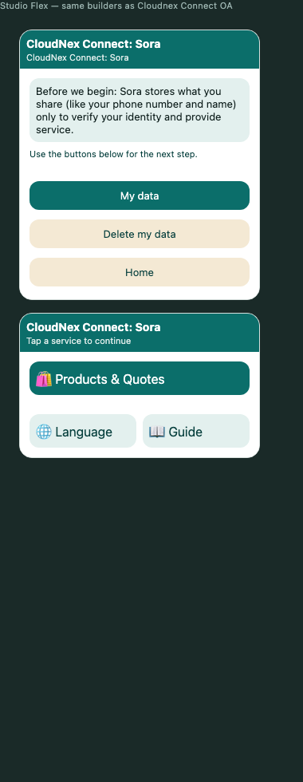
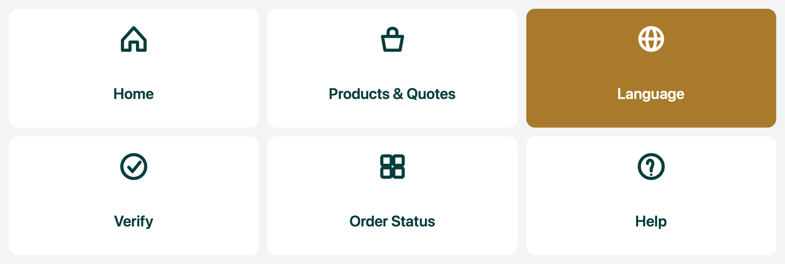

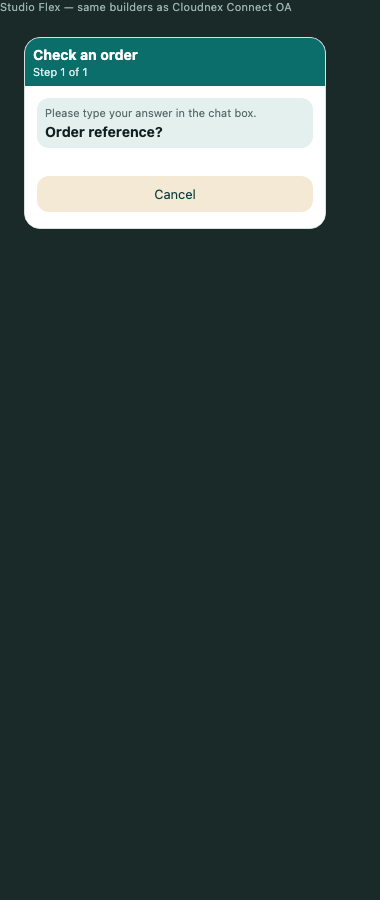
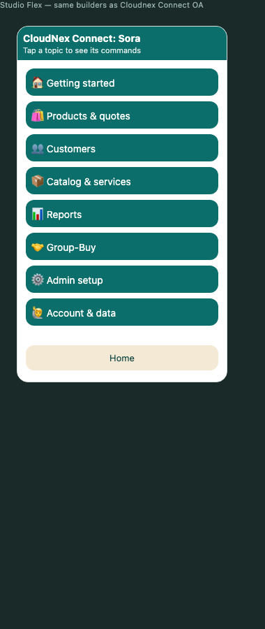
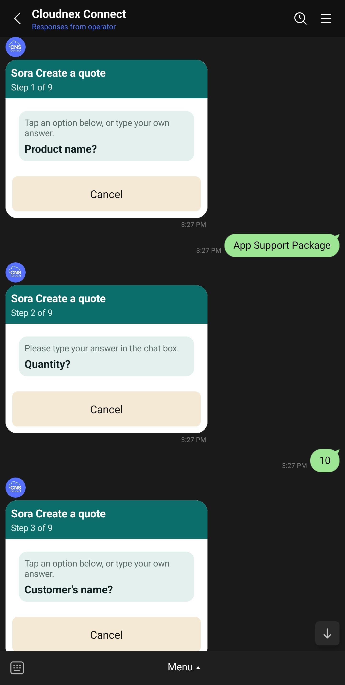
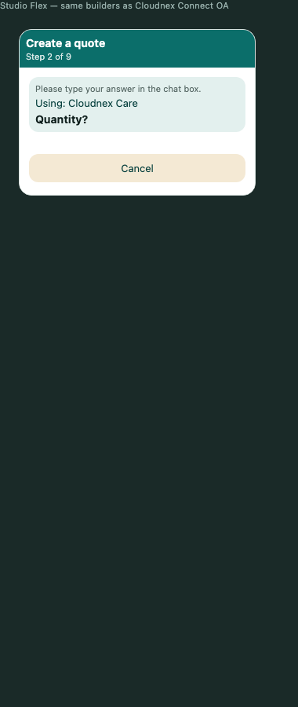
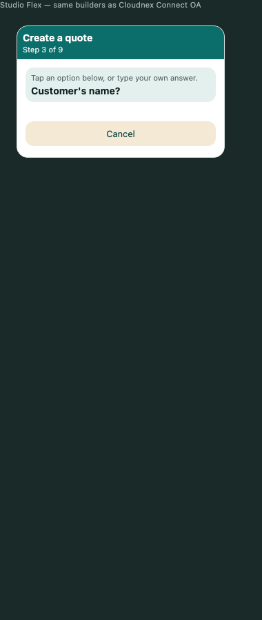

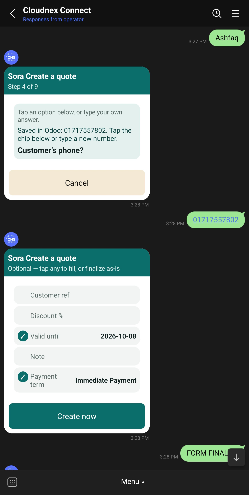

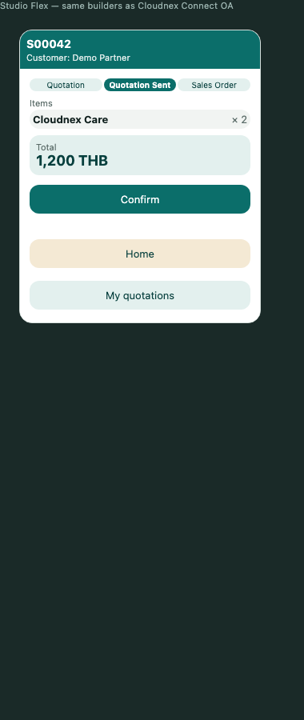
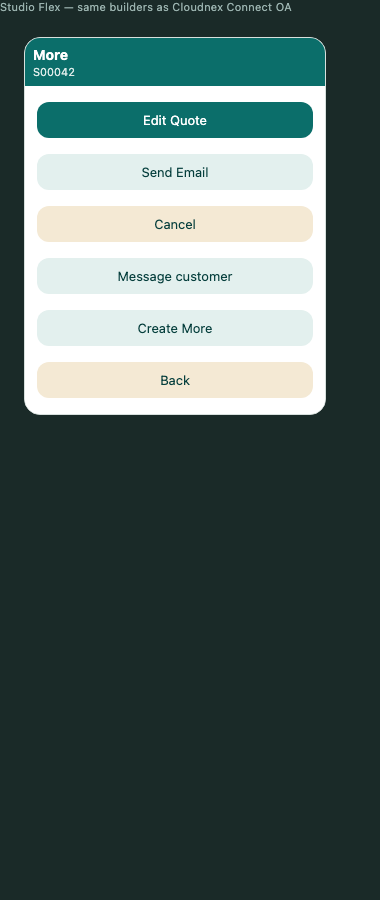
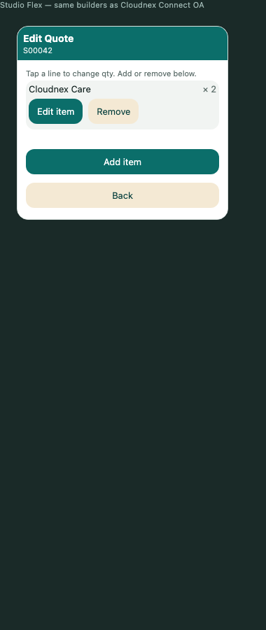
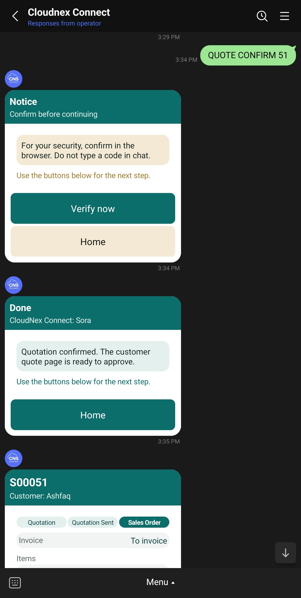

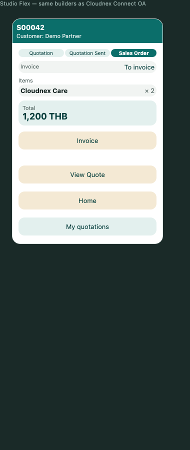

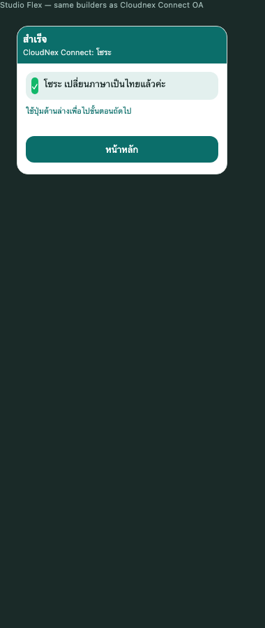
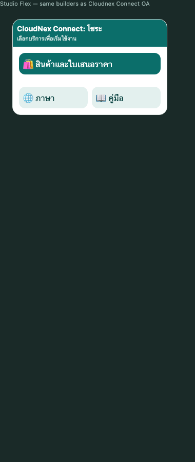
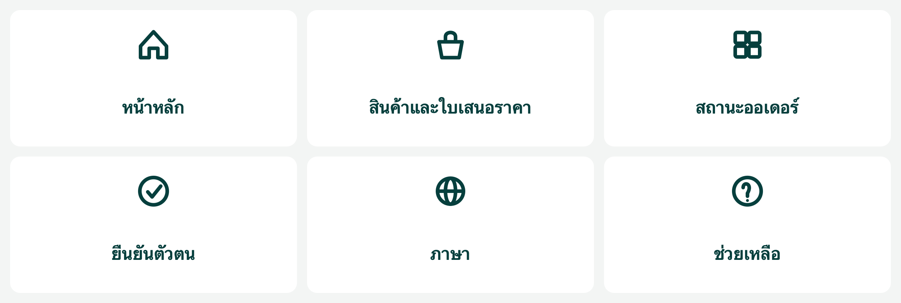

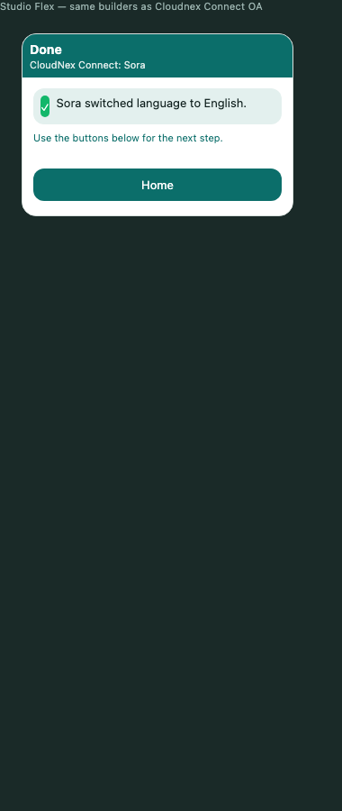

In git today: `a3-verify`, `a4-products-quotes`, `b1`, `b4`, `b5`, `b6`, `b8`, `c1-customer-approve`, `c2-sales-order-admin`, `c4-invoice-staff`. Recapture those if they predate v5.0.1. Still needed: Customer C0–C5, A1–A2, A3 language, A5–A6, B2–B3, B9–B11, C3 customer SO, D1–D5. After capture, commit only the journey filenames.

---

## Design freeze

Live OA + this book are the source of truth. Do not restyle Flex or the tray unless a capture step fails. Bugs (wrong command, Thai on default English, missing Send) get a small fix and a re-shot of that page only.

Out of scope until a new ticket: Odoo e-sign, payment capture, customer invoice, extra npm UI packages, a second command router, GraphQL LINE events.

Related: `documents/STORYBOARD.md` (capability status), `documents/DESIGN_SYSTEM.md` (tokens), `documents/requirement/MGT_Implementation_Playbook.md` (Phase 1 Odoo vs Phase 2 LINE, UAT).

Internal 3-stage approval is **Odoo**, not LINE `QUOTE APPROVE` (customer accept of a sent quote). Staging hook: `POST /ops/odoo-hook` with ops token, body `{ "event": "picking.done"|"approval.stage", "orderId": <so id> }`. Approvers open Odoo; LINE notifies Sales OA.
